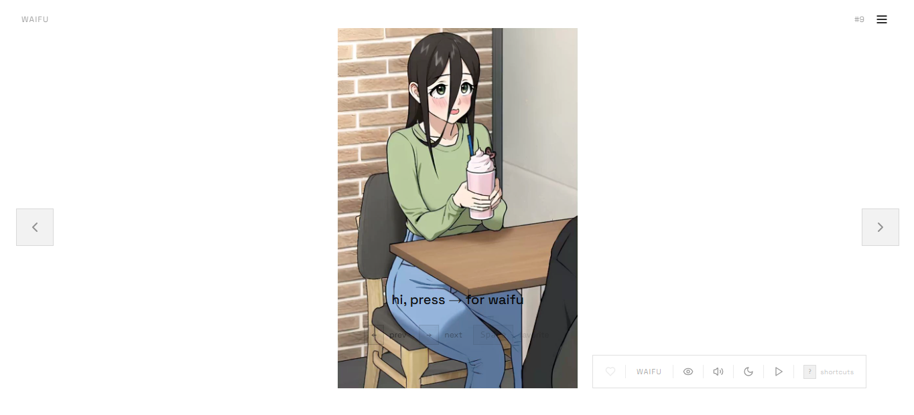

`SwipeWaifu`

> Discover unlimited anime waifu images! Swipe through 30+ categories, save favorites, and download your best finds and chat with Anime Fanbase.

**Live: [https://iamovi.github.io/SwipeWaifu/](https://iamovi.github.io/SwipeWaifu/)**

## Features

- **Swipe or click** to fetch random waifu images
- **30+ SFW categories** — waifu, neko, shinobu, megumin, and more
- **NSFW mode** with age verification
- **Favorites** — save and manage your collection
- **Auto-slide** — sit back and watch with adjustable speed (2s / 3s / 5s / 10s)
- **History navigation** — go back and forward through viewed images
- **Keyboard shortcuts** — arrow keys, space, and more
- **Desktop optimized** — side arrows, floating toolbar, sidebar menu
- **Mobile optimized** — swipe gestures, fullscreen experience
- **Dark / Light theme** toggle
- **Sound effects** with mute control
- **PWA** — installable on mobile and desktop
- **Talks** — Anime fanbase community chat

## Keyboard Shortcuts for PC

| Key | Action |
|-----|--------|
| `→` `↓` | Next waifu |
| `←` `↑` | Previous waifu |
| `Space` | Toggle favorite |
| `A` | Toggle auto-slide |
| `M` | Mute / Unmute |
| `?` | Show shortcuts |

---

created by [Ovi ren](https://iamovi.github.io)

released under [MIT license](../LICENSE)